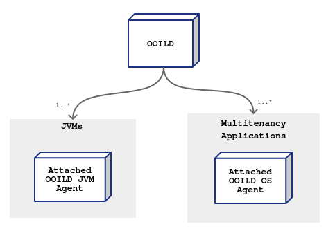

# Olive Oil Intelligent Load Distribution (aka OOILD)
Olive is a modern open source Load Balancer written in Java to solve key HA patterns and standards. It uses server introspection and intelligent load distribution to determine (compute) the right load path for your backend applications.

> **OOILD** is based on Apache's _Http Components_ to serve its HTTP asymptomatic requests, and several APIs to maintain its functions.

## Basic Architecture
Besides supporting common LD algorithms including _hashing_, _round-robin_, OOILD goes further and implements the concept of "inteligent loading" by resolving the health of one's particular system during any given time. It implements that by using the idea of  "_Running Agents_". The Agent's core responsibility is to continously instrospect the system's internal health and safely send healthchecks to the Olive Server.

Healthcheck interations are suppose to verify system usage, e.g. for Java these steps includes active JVM memory organization, GC cycle activities, number of active threads, and system statistics (_swap usage, system memory, storage and more_).

> For now the Agents can only be run on Unix-like boxes, supporting bash version 3.0+, e.g. Linux. Run `verify_system` to check if the current agent supports your platform or not.

On each Agent interaction, the system may be extended by implementating custom _Agent Actions (aka Actlets)_, where any custom verifications can be applied. The _Actlets_ can also be configured in a chain, where each step will contribute to the final check verification of the corresponding node health being monitored.
